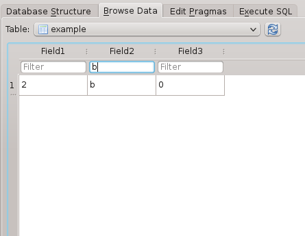

## Introduction
When browsing a table a filter row consisting of one input field per column is shown between the table header and the actual table data. These filters allow you to perform quick searches in the currently selected table. The search is performed as soon as you start typing.

## Visual example
This section provides some examples for people not familiar with SQL.

Consider the following table:

Say, you want to search for those records with Field2 set to 'b'. In this case all you need to do is type 'b' in the column's filter:

As you can see it performs an exact search, that is the records where Field2 contains a 'b' are not shown. To achieve this you are free to use the '%' wild card. 'b%' searches for records starting with 'b', '%b' searches for records ending in 'b' and '%b%' searches for records containing a 'b' at any position. You are free to use as many '%' wild cards as you wish and in any combination. Here's an example:

By default, SQLiteBrowser performs an exact search for numbers and an exact but case-independent search for text. You can override this behaviour by specifying a comparison operator. You can do so by adding one of the supported operators at the beginning of your query. Have a look at this example where we search for those records with a value greater than one in Field3:

For a full list of supported operators see the table below. You can also combine multiple filters by just using two or more input fields. By doing so a record must meet all criteria to be still shown:

## Supported operators
The default comparison operator used by SQLiteBrowser is an exact comparison for numbers and an exact but case-independent comparison for text. In both cases wild cards ('%') are allowed. You can override this behaviour by starting your query with one of these operators, e.g. '>1':

Operator | Description         | Notes
---------|---------------------|------
>        | Greater than        | 
<        | Less than           | 
>=       | Equal to or greater | 
<=       | Equal to or less    | 
=        | Equal to            | Unlike the default behaviour this performs an 100% exact search, i.e. not case-independent and '%' characters not treated as wild cards but as normal characters.
<>       | Unequal             | This is the opposite of the '=' operator, that is no wild cards allowed and case-dependent search.

## A look behind the scenes
For those familiar with the SQL syntax the filters are very easy to understand. The filters are translated into the WHERE part of the SELECT statement, joined by AND operators. The default comparison operator is LIKE but can be overridden as described in the table above. SQLiteBrowser automatically detects a numeric search and omits the quote characters around the search term in this case while adding them for text searches. Single quote characters are automatically escaped and can therefore safely be used in a filter query. In case of any doubt you might want to check the generated SQL statement using the SQL Log panel - just make sure it is set to showing SQL submitted by the 'Application'.