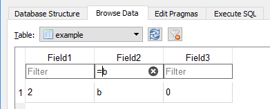

## How to compile SQLCipher on Win64

### Requirements

* [ActiveState ActiveTcl 8.5 Community Edition](https://www.activestate.com/activetcl/downloads)
  * Windows (64-bit, x64)
* [GitHub Desktop for Windows](https://desktop.github.com)
  * GitHub Desktop for Windows 7 or later
* [Microsoft Visual Studio Community 2013 Edition Update 5](https://www.visualstudio.com/downloads/download-visual-studio-vs)
  * Click the "Visual Studio 2013" option 1/2 way down the left side → "Community 2013" → ISO
* [OpenSSL](https://wiki.openssl.org/index.php/Binaries)
  * From the first link (Shining Light Productions) → Win64 OpenSSL (use latest version)

### 1. Install Visual Studio 2013

Install Visual Studio 2013 using the instructions [here](https://github.com/sqlitebrowser/sqlitebrowser/wiki/Win64-setup-—-Step-2-—-Install-MSVC2013).

Only follow the instructions for that one page, not the rest of the guide it is part of.

### 2. Install ActiveTcl 8.5

Install ActiveTcl 8.5 using the instructions [here](https://github.com/sqlitebrowser/sqlitebrowser/wiki/Win64-setup-—-Install-ActiveTcl-8.5).

### 3. Install OpenSSL

Install OpenSSL using the instructions [here](https://github.com/sqlitebrowser/sqlitebrowser/wiki/Win64-setup-—-Step-4-—-Install-OpenSSL).

Only follow the instructions for that one page, not the rest of the guide it is part of.

### 4. Clone the SQLCipher repository

Launch GitHub Desktop, then click the **+** sign in the upper left corner:

Then click the "Clone" tab.

Assuming you have forked the "sqlcipher" repository already, it should be in the list. If it is not then go to https://github.com/sqlcipher/sqlcipher and Fork the repository first.

Select it, then click "Clone **sqlcipher**":

Choose the `C:\git_repos` directory for cloning into:

### 5. Edit Makefile.msc

Open the SQLCipher source code folder:

Edit the file `C:\git_repos\sqlcipher\Makefile.msc` using a text editor:

### Values to be changed

* `SQLITE3DLL` - Should be changed to `sqlcipher.dll`

* `SQLITE3LIB` - Should be changed to `sqlcipher.lib`

* `SQLITE3EXE` - Should be changed to `sqlcipher.exe`

* `SQLITE3EXEPDB` - Should be changed to `/pdb:sqlciphersh.pdb`

* `-DSQLITE_TEMP_STORE` - Change it from 1 to 2

* `-DSQLITE_HAS_CODEC` - Add this value to the `TCC` and `RCC` variables

* `-IC:\dev\OpenSSL-Win64\include` - Add this value to `TCC` and `RCC` too

* `/LIBPATH:C:\dev\OpenSSL-Win64\lib /LIBPATH:C:\dev\OpenSSL-Win64\lib\VC` - Add to the `LTLIBPATHS` variable
* `capi.lib padlock.lib libcrypto.lib libssl.lib` - Add to the `LTLIBS` variable
 * Note - These filenames are just the list of files from C:\dev\OpenSSL-Win64\lib.  If you have different files in your directory, use your filenames instead.

* Do a case sensitive search-n-replace, changing `sqlite3.def` to `sqlcipher.def` (you should find 6 instances)

_[no screenshots done yet :wink:]_

### 6. Compile SQLCipher

Launch the "VS2013 x64 Native Tools Command Prompt".

It's accessed through the "Visual Studio Tools" item in the Win 8.1 menu structure.

Change to the `C:\git_repos\sqlcipher` directory:

Then run this command to compile SQLCipher:

    nmake /f Makefile.msc

It should run for about a minute or so, and you'll see various other commands running in the command prompt window.

It should finish without error, looking something like this:

If so, the process is now complete, with SQLCipher successfully compiled. 😋

### 7. Compile SQLCipher into DB4S ###

_[This step still needs to be written up properly.]_

With Qt Creator, enable the `sqlcipher` option like this:

If using MSVC 2013 as the IDE instead of Qt Creator, add "-Dsqlcipher=1" to the cmake
command for generating the solution file.  Like this:

    cmake -G "Visual Studio 12 2013 Win64" -Wno-dev -Dsqlcipher=1
